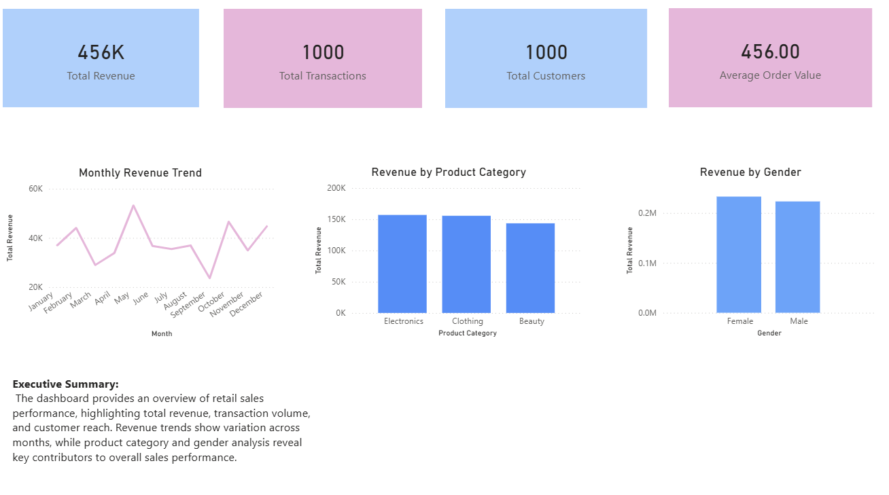
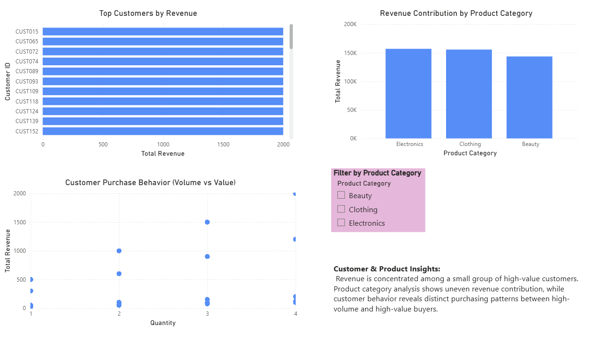

# Retail Sales Performance Analysis (Excel & Power BI)

This project analyzes retail sales data to evaluate overall business performance, customer behavior, and product category contribution. The analysis was conducted using Excel for data cleaning and exploratory analysis, and Power BI for interactive dashboard visualization.

---

## Tools Used
- Microsoft Excel
- Power BI
- Data visualization & business analytics techniques

---

## Project Objectives
- Analyze overall sales performance using key business KPIs
- Identify top-performing product categories
- Understand customer demographics and purchasing behavior
- Track revenue trends over time
- Build an interactive Power BI dashboard for decision-making

---

## Key KPIs
- Total Revenue
- Total Transactions
- Total Customers
- Average Order Value (AOV)
- Average Revenue per Customer
- Total Units Sold

---

## Excel Analysis
The Excel analysis involved:
- Data cleaning and validation
- KPI creation
- Pivot table analysis for:
  - Revenue by product category
  - Revenue by gender
  - Revenue by age group
  - Monthly revenue trends
  - Customer purchase behavior (volume vs value)

The cleaned Excel file is included in the `data` folder.

---

## Power BI Dashboard
The Power BI dashboard consists of two pages:

### 1️⃣ Executive Overview
- KPI summary cards
- Monthly revenue trend
- Revenue by product category
- Revenue by gender

---

### 2️⃣ Customer & Product Insights
- Top 10 customers by revenue
- Revenue contribution by product category
- Customer purchase behavior (volume vs value)

---

## Key Insights
- Revenue is concentrated among a small number of high-value customers
- Certain product categories contribute a disproportionate share of total revenue
- Customer purchasing behavior varies between high-volume and high-value buyers
- Monthly revenue trends indicate potential seasonality

---

## Business Recommendations
- Focus retention strategies on high-value customers
- Allocate marketing and inventory resources to top-performing categories
- Use seasonal revenue trends to plan promotions and stock levels

---

## Repository Structure

---

## Author
Chibuike Henry 

Aspiring Data Analyst | Excel | Power BI | SQL | Python
